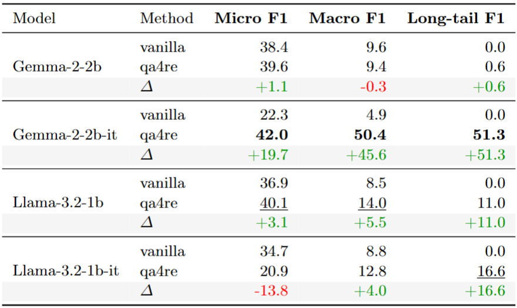
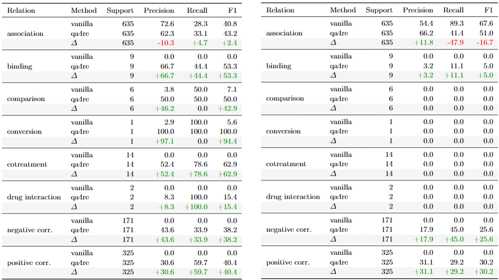
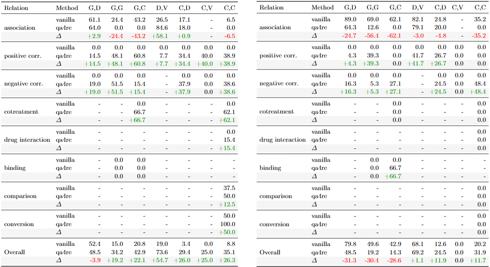

# Overview
We evaluate zero-shot relation extraction on the BioRED dataset using its original test split.  
The task is framed as sentence-level relation classification between annotated biomedical entity pairs.

## Task Definition
**Input:**  
A text span containing a pair of annotated entities, along with their entity types.

**Output:**  
A single relation label describing the relationship between the two entities.

**Label space:**  
The full BioRED relation taxonomy, including *Association* (majority class) and minority relations:
Positive Correlation, Negative Correlation, Binding, Cotreatment, Drug Interaction, Comparison, and Conversion.

We compare two task formulations:

- **VanillaRE:**  
  The model directly predicts one relation label given the input text and entity pair.

- **QA4RE:**  
  The task is reformulated as a structured multi-choice question answering problem, where the model selects the most appropriate relation from a constrained list of options. This formulation enforces contrastive decision-making rather than free-form generation.

Both formulations use fixed prompt templates to ensure consistency across models.

## Models

We evaluate four small-scale LLMs:
- Gemma-2-2b  
- Gemma-2-2b-it  
- Llama-3.2-1b  
- Llama-3.2-1b-it  

## Inference Setup

- **Inference framework:** vLLM  
- **Precision:** bf16  
- **Hardware:** 1× NVIDIA A6000 GPU  
- **Decoding strategy:** Guided decoding with FSM

## Metrics
- **Micro F1** – Micro F1-score across relations  
- **Macro F1** – Averages performance equally across all relation types of each binary F1 score of the relation.  
- **Long-tail F1** – Defined as Macro F1 excluding the majority class (Association) to measure minority relation performance.

# Implementation details
## Prompt templates
**Vanilla RE**: We directly prompt the LLM to predict the relation given 2 entities with the following template, the sentence is truncated for brevity but we use the full sentence to inference:

>Given a Sentence, and two Entities within the Sentence, classify the relationship between the two Entities based on the provided Sentence. All possible Relationships are listed below with explanations:
>- Association: Entity 1 is associated with Entity 2
>- Positive_Correlation: Entity 1 has positive correlation with Entity 2
>- Negative_Correlation: Entity 1 has negative correlation with Entity 2
>- Bind: Entity 1 binds to Entity 2
>- Cotreatment: Entity 1 is used in cotreatment with Entity 2
>- Comparison: Entity 1 is compared to Entity 2
>- Drug_Interaction: Entity 1 interacts with drug Entity 2
>- Conversion: Entity 1 is converted to Entity 2
>
>Sentence: High frequency of lamivudine resistance mutations in Brazilian patients [co-infected with HIV and hepatitis B]. ... The length of exposure to LAM and TDF varied from 4 to 216 months. LAM resistance substitutions (rt[L180M] + rtM204V) were detected in 10 (50%) of the 20 patients with viremia.
>Entity 1: co-infected with HIV and hepatitis B
>Entity 2: L180M
>Relationship:

**QA4RE**: We follow QA4RE setup and cast RE as the multiple choice question with the following template, the sentence is truncated for brevity but we use the full sentence to inference:

>Determine which option can be inferred from the given Sentence.
>
>Sentence: High frequency of lamivudine resistance mutations in Brazilian patients [co-infected with HIV and hepatitis B]. ... The length of exposure to LAM and TDF varied from 4 to 216 months. LAM resistance substitutions (rt[L180M] + rtM204V) were detected in 10 (50%) of the 20 patients with viremia.
>Options:
>A. [co-infected with HIV and hepatitis B] is associated with [L180M]
>B. [co-infected with HIV and hepatitis B] has positive correlation with [L180M]
>
>Which option can be inferred from the given Sentence?
>Option:

## Label constraint
To constraint the label space for QA4RE settings, we scan through the BIORED dataset to build a label constraint dict `data/BIORED/configs/possible_labels.json`:

>{
>    "{entity type 1} -> {entity type 2}": [list of all possible relation]
>}
 
Given 2 entities belonging to 2 entity types, we only show their possible relation as multiple choices respectively.

# Results analysis
**Overall results**:

Across models, QA4RE leads to clear improvements in overall performance for most settings. In particular, Gemma-2-2b-it benefits the most, showing substantial gains across all metrics (+19.7 Micro, +45.6 Macro, +51.3 Long-tail), indicating that instruction tuning aligns well with the structured QA formulation. For base models such as Gemma-2-2b and Llama-3.2-1b, QA4RE provides consistent improvements, with noticeable gains in both overall performance and minority-class detection. This suggests that the reformulation itself contributes meaningfully beyond model-specific factors. An interesting contrast appears for Llama-3.2-1b-it, where QA4RE reduces overall performance but improves Macro and Long-tail F1. 

*Conclusion*:
- The models show a clear limitation on minority classes.
- QA4RE consistently enhances minority relation detection across models.

## Diagnosis
### Per-relation performance

Given that BioRED is severely imbalanced, with *Association* dominating the label distribution, the vanilla models naturally collapse toward the majority class and fail to detect minority relations.

**Gemma-2-2b-it** (left) shows substantial recovery on minority classes. Relations that were completely missed in the vanilla setting (e.g., binding, cotreatment, drug interaction, positive and negative correlation) become detectable with meaningful F1. This indicates that the structured formulation effectively counteracts imbalance for Gemma.

For **Llama-3.2-1b** (right), improvements are more moderate. While positive and negative correlation improve, several low-support relations remain undetected. This suggests that QA4RE reduces majority bias for Llama but does not fully overcome its limitations on rare classes.

*Conclusion*: in a highly imbalanced setting, QA4RE mitigates minority-class collapse for both models, with a significantly stronger effect observed for Gemma.

### Per-entity performance

We additionally include the per-entity performance of Gemma-2-2b-it (left) and Llama-3.2-1b (right) to facilitate comparison with Table S3 from the [BIORED](https://arxiv.org/pdf/2204.04263) paper. Note that Table S3 reports results from a fully fine-tuned model, whereas our results are strictly zero-shot.
Despite this difference, Gemma-2-2b-it under QA4RE achieves competitive performance, particularly given the absence of task-specific training.

# Improvements
We attribute the model limitations to three main factors:
1. *Domain gap*, as biomedical relation extraction requires specialized knowledge beyond general pretraining.
2. *Majority-class bias*, especially in the vanilla setting, where models over-predict Association, resulting in near-zero Long-tail F1.

To address the limitations:
## 1. Domain gap:
We hypothesized that the multiple-choice relation labels were too brief, making it difficult for the model to distinguish subtle semantic differences. To address this, we augmented each choice with an elaborated relation definition.

We prompted ChatGPT to generate a BIORED-aligned relation definition dictionary:

`data/BIORED/configs/relation_definitions.json`

We then modified the QA4RE prompt so that each option followed the format:

> `[ENT1] <definition of relation> [ENT2]`

This explicitly encodes semantic meaning into each choice rather than relying solely on short relation names.

---
### Gemma-2-2b-it

**QA4RE**
- Micro F1: 0.420
- Macro F1: 0.504
- Long-tail F1: 0.513

**QA4RE + Relation Definitions**
- Micro F1: **0.450** ↑
- Macro F1: 0.240 ↓
- Long-tail F1: 0.215 ↓

### Llama-3.2-1b

**QA4RE**
- Micro F1: 0.401
- Macro F1: 0.140
- Long-tail F1: 0.110

**QA4RE + Relation Definitions**
- Micro F1: **0.419** ↑
- Macro F1: 0.134 ↓
- Long-tail F1: 0.086 ↓
---
While augmenting relation definitions improves overall accuracy, it appears to reinforce majority-class bias. The richer definitions likely make the dominant relation (*Association*) easier to match, increasing confidence in majority predictions while reducing discrimination among minority relations.

*Conclusion*: improving semantic clarity does not necessarily improve minority-class detection in a severely imbalanced setting.

## 2. Majority-class bias

We hypothesized that the gains observed with relation definitions may be partially driven by the well-known multiple-choice position bias, where LLMs exhibit preference toward earlier answer options. In our setup, the first choice corresponds to *Association*, which is also the majority class.

To test this, we shuffled the answer options and reran QA4RE across 5 different seeds.

---

### Shuffled Results (Mean ± Std over 5 Seeds)

#### Gemma-2-2b-it

- Micro F1: 46.42% ± 0.86% (vs. 42.0%)
- Macro F1: 35.91% ± 3.00% (vs. 50.4%)
- Long-tail F1: 33.89% ± 3.28% (vs. 51.3%)

#### Llama-3.2-1b

- Micro F1: 35.30% ± 0.97% (vs. 40.1%)
- Macro F1: 14.24% ± 0.83% (vs. 14.0%)
- Long-tail F1: 12.91% ± 1.27% (vs. 11.0%)

For Gemma, Macro and Long-tail F1 drop substantially after shuffling, indicating that part of the original gain was influenced by answer-position bias. This suggests that the model was *lucky* and benefited from consistently selecting the first option, which aligns with the majority class.

For Llama, the effect is milder but still observable in Micro F1.

---

### Voting across shuffled seeds

To mitigate position bias, we aggregate predictions across the 5 shuffled runs using majority voting.

#### Gemma-2-2b-it (Voting)

- Micro F1: 48.67%
- Macro F1: 41.20%
- Long-tail F1: 36.78%

#### Llama-3.2-1b (Voting)

- Micro F1: 37.02%
- Macro F1: 13.45%
- Long-tail F1: 11.62%

---

For **Gemma**, voting clearly improves overall performance. Micro F1 increases compared to both the original fixed-order QA4RE result and the shuffled average, indicating that aggregation stabilizes predictions and reduces order sensitivity. However, Macro and Long-tail F1 remain below the original fixed-order result, suggesting that voting improves robustness but does not fully restore minority-class performance.

For **Llama**, voting provides only marginal stabilization. Micro F1 improves slightly compared to the shuffled mean but does not exceed the original QA4RE result. Macro and Long-tail F1 remain largely unchanged.

*Conclusion*: voting improves robustness and overall accuracy when the model is highly sensitive to answer order (as in Gemma), but it does not fundamentally solve the minority-class limitation caused by dataset imbalance.

## Future Work

- **Fine-tuning:** Adapt models on BioRED or related biomedical RE datasets to reduce domain gap and improve minority-class performance.

- **Retrieval augmentation:** Incorporate example or definition retrieval to better ground relation distinctions.

- **Uncertainty estimation:** Use logits entropy or confidence scores to detect uncertain predictions and enable human-in-the-loop review.

